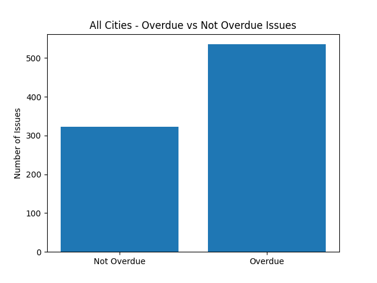

# 🌍 CivicPulse — Organization Overview

**CivicPulse** is a civic-tech initiative focused on improving urban living by enabling citizens to report local issues and helping communities and authorities make **data-driven decisions**.

Our platform operates across **mobile and web**, each serving a distinct purpose within the same ecosystem.

> A single civic system. Multiple access points.

---

## 🧠 What Is CivicPulse?

CivicPulse is designed to:
- Collect real-time civic issue reports from citizens
- Visualize problems spatially using maps
- Analyze city-wide data using AI & analytics
- Highlight trends, hotspots, and priority areas
- Encourage civic participation through transparent tracking

The goal is not just reporting — but **understanding and action**.

---

## 🏗️ Platform Architecture

CivicPulse follows a **dual-model approach**:

- **App-based model** → Citizen interaction & data collection  
- **Web-based model** → Visualization, monitoring & analysis  

Both platforms share the same backend and data sources but are optimized for different users and use cases.

---

## 📱 App-Based Model (Citizen-Focused)

### Purpose
- Enable citizens to quickly report civic issues
- Make participation simple, fast, and accessible
- Allow users to track their own complaints

### Key Capabilities
- Report issues with category, description, and location
- View nearby problems on a live map
- Track complaint status (Pending / Resolved)
- Access AI-generated city insights in simplified form
- Earn karma for verified contributions

### Primary Users
- Citizens
- Community members
- Local residents

---

## 🌐 Web-Based Model (Monitoring & Overview)

### Purpose
- Provide a high-level overview of civic issues
- Enable monitoring of trends and hotspots
- Support data-driven decision-making

### Key Capabilities
- Interactive city map with issue clustering
- Category-based filtering and visualization
- Neighborhood health indicators
- Contributor activity and engagement insights
- AI-powered summaries and recommendations

### Primary Users
- Authorities
- Urban planners
- NGOs
- Analysts
- Hackathon judges / stakeholders

---

## 🔍 App vs Web — At a Glance

| Aspect | App-Based Model | Web-Based Model |
|------|-----------------|-----------------|
| Focus | Reporting & participation | Monitoring & analysis |
| Target Users | Citizens | Authorities / Analysts |
| Core Function | Submit & track issues | Visualize & analyze issues |
| Interaction Style | Personal & task-driven | Exploratory & data-driven |
| Usage Context | On-the-go | Desktop / large-screen |

---

## 📊 Data Analytics & Insights (CivicPulse Intelligence Layer)

CivicPulse transforms raw complaint data into **actionable civic intelligence** using analytics and predictive modeling.

---

### 🏙️ City-Wide Issue Status Overview

This visualization compares **overdue vs non-overdue issues across all cities**.

**Insight:**
- A majority of reported complaints fall under the **Overdue** category
- Indicates systemic delays in issue resolution
- Highlights the need for better prioritization and escalation mechanisms

This helps authorities:
- Identify resolution bottlenecks
- Measure operational efficiency
- Track overall civic health

---

### 📍 City-Level Analysis — Bengaluru

City-specific analytics help identify localized inefficiencies.

**Insight:**
- Bengaluru shows a higher number of **overdue issues** compared to active ones
- Suggests pressure on civic infrastructure or response workflows

Use cases:
- Targeted city-level interventions
- Comparative analysis across cities
- Resource reallocation

---

### ⏳ Remaining Days Prediction Distribution (Bengaluru)

CivicPulse uses predictive modeling to estimate **remaining days until issue resolution**.

**How to read this:**
- **Negative values** → issues already overdue
- **Positive values** → issues likely to be resolved in the future
- Wide distribution → inconsistent resolution timelines

**Why this matters:**
- Early identification of high-risk complaints
- Proactive escalation
- SLA and accountability monitoring

---

## 🤖 Role of AI in CivicPulse

AI is used to:
- Aggregate and summarize complaints
- Identify most affected categories
- Detect emerging trends
- Generate actionable recommendations

**Presentation differs by platform:**
- **App:** simplified insights for citizens  
- **Web:** detailed analytics for authorities and planners  

---

## 🧩 Unified Ecosystem

Although the app and web platforms differ in function, they operate as **one unified system**:

- Shared backend and datasets
- Consistent issue categories
- Unified map-based representation
- Real-time synchronization

This ensures:
- No data silos
- Platform-independent insights
- Scalable civic infrastructure

---

## 🚀 Vision

CivicPulse aims to bridge:
- **Citizens** who experience civic problems
- **Data** that reveals hidden patterns
- **Authorities** who can act on insights

By combining community reporting with AI-driven analytics, CivicPulse moves civic problem-solving from **complaints to clarity**.

---

## 📌 Project Status

- Core app and web platforms implemented
- Live map and reporting functional
- Analytics & AI layer integrated
- Currently in **prototype / beta stage**

---

## 👥 Developers

- **Krishna Agarwal** — Web Developer  
  https://github.com/KrishnaAgarwal7

- **Tahoor** — App Developer  
  https://github.com/TaH00R

- **Nishchay Joshi** — Data Analyst    
  https://github.com/nishchay-joshi

---

Built for **TechSprint Hackathon** with ❤️  
Turning civic voices into civic intelligence.
