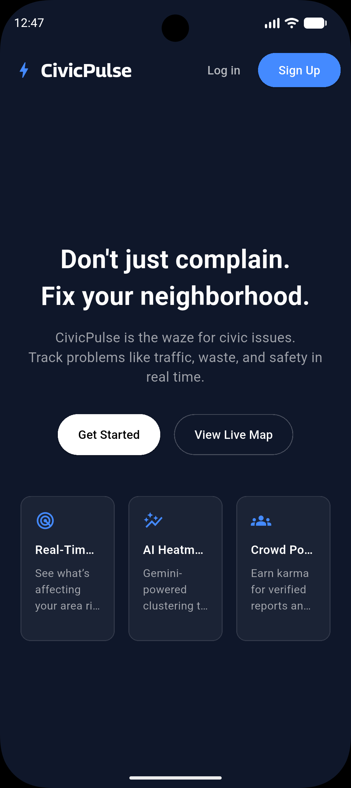
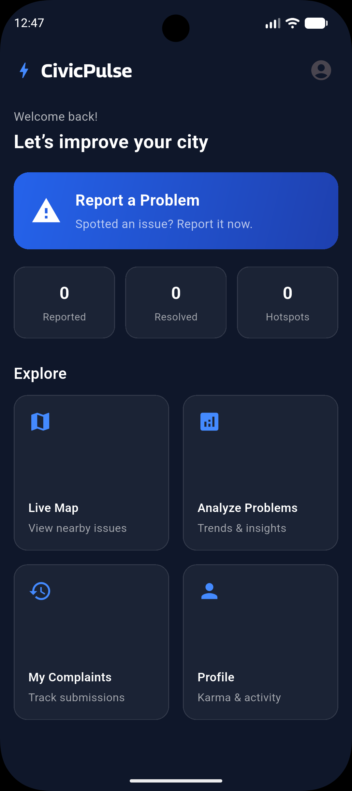
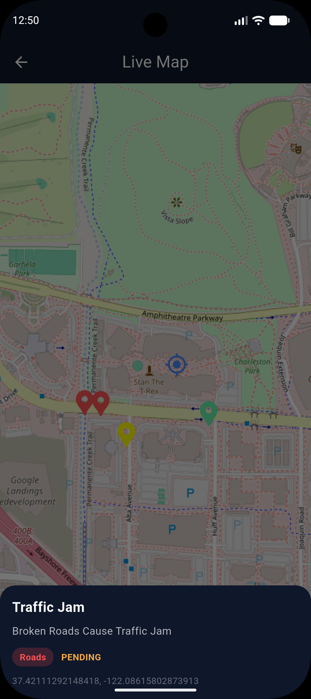
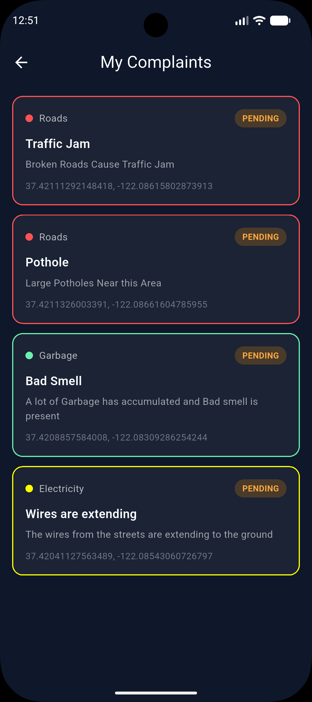
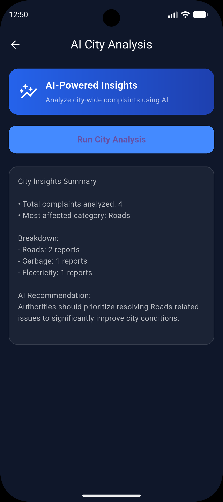

# 🚀 CivicPulse

**CivicPulse** is a civic-tech application that enables citizens to report local issues and helps communities understand city-wide problems through real-time data and AI-powered insights.

> Don’t just complain. Fix your neighborhood.

---

## 🌆 Overview

CivicPulse allows users to:
- Report civic issues like traffic, garbage, electricity, and safety
- View nearby issues on a live interactive map
- Analyze city-wide complaints using AI-generated summaries
- Track submitted complaints and their status
- Encourage community participation through karma points

---

## ✨ Features

- **Live Map**
  - Real-time visualization of reported issues
  - Category-based colored markers

- **Issue Reporting**
  - Submit complaints with title, description, category, and location

- **AI City Analysis**
  - Automatically summarizes complaints
  - Highlights the most affected categories
  - Provides actionable recommendations

- **My Complaints**
  - Track submitted issues
  - Status indicators (Pending / Resolved)

- **Clean UI**
  - Dark-themed, modern, and consistent design across screens

---

## 📱 App Screenshots

### Core Screens

| Startup | Home | Live Map |
|--------|------|---------|
|  |  | |

|  My Complaints | AI City Analysis |
|---------------|-----------------|
|   |  |


---

## 🛠️ Tech Stack

- **Framework:** Flutter  
- **Backend:** Firebase  
- **Maps:** OpenStreetMap  
- **AI:** Gemini-powered analysis  
- **Platforms:** Android, iOS, Web, Desktop

---

## 📂 Project Structure

```text
.
├── demos/        # Screenshots used in README
├── lib/          # Main Flutter source code
├── ios/          # iOS platform files
├── macos/        # macOS platform files
├── linux/        # Linux platform files
├── test/         # Test files
└── build/        # Build outputs
```
---
## 🧠 Project Status

- Core functionality completed
- UI finalized
- AI analysis integrated
- Currently in beta / prototype stage
---
## 🔒 Security
- Sensitive files such as API keys and Firebase configuration files are excluded from version control to ensure security.
---
## 📌 Vision
CivicPulse aims to improve urban living by making civic issues:
- Visible
- Data-driven
- Community-powered
- Actionable for authorities
---
## 🚧 Future Scope
- Authority dashboard
- Complaint resolution workflow
- Hotspot & trend visualization
- Notifications and alerts
- Role-based access
