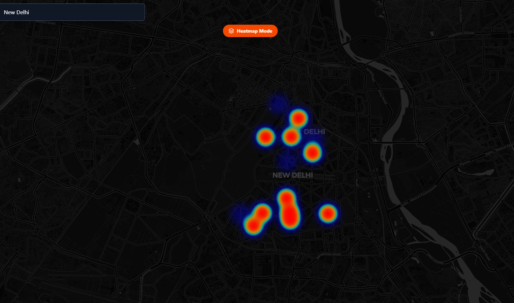

# 🌍 CivicPulse — Real-Time Civic Issue Radar

> **"Waze for Civic Issues."**
> A hyper-local, crowd-sourced platform that empowers citizens to report, track, and solve neighborhood problems using AI and real-time mapping.

## 🚀 The Problem
Current systems for reporting civic issues (potholes, garbage, broken lights) are slow, opaque, and reactive. Authorities often lack real-time visibility into what is happening on the ground *right now*.

## 💡 The Solution
**CivicPulse** bridges the gap between citizens and authorities.
* **Visual:** Issues are pinned on a live map, not buried in a list.
* **Smart:** AI analyzes images to verify reports and prevent spam.
* **Actionable:** Heatmaps show authorities exactly where to focus their resources.

---

## ✨ Key Features

### 📍 1. Interactive Live Map
* Drop pins instantly for **Traffic, Waste, Lighting, or Safety** issues.
* Real-time updates across all connected devices using **Firestore**.

### 🔥 2. AI Heatmaps (Density Mode)
* Toggle between "Pin View" and "Heatmap View."
* Visualizes high-density problem zones (Red Zones) so authorities can prioritize interventions.

### 🤖 3. AI Verification Agent
* Users upload photo evidence.
* **Simulated AI Agent** analyzes the image to verify the claim before it goes public.
* *Tech used: Computer Vision Simulation / Gemini integration ready.*

### 🏆 4. Gamified Leaderboard
* Users earn **Karma Points** for every verified report.
* Live leaderboard ranks top "Community Heroes" to drive engagement.

---

## 🛠️ Tech Stack

* **Frontend:** React.js (Vite), Tailwind CSS
* **Mapping:** Leaflet.js, OpenStreetMap API
* **Backend:** Firebase (Firestore, Authentication, Storage)
* **Icons:** Lucide React

---

## 📸 Screenshots

|**Landing Page**| **Live Dashboard** | **Map View** | **Heat Map View** |
|:---:|:---:|
|  |  |  |  |

---

## 🔐 Admin & Demo Features

To demonstrate the full power of CivicPulse during a presentation:
1.  **Admin Mode:** Add `/?mode=admin` to your URL (or login as `admin@test.com`).
2.  **Populate Data:** Click the **"🇮🇳 Populate India"** button in the sidebar to instantly simulate 50+ reports across major Indian cities.
3.  **Reset:** Use the **"Reset Database"** button to clear the map for a fresh demo.

---

## 👥 Contributors
* [Krishna Agarwal](https://github.com/KrishnaAgarwal7) - Web Developer

---

*Built with ❤️ for [TechSprint Hackathon IIIT Guwahati] 2025.*